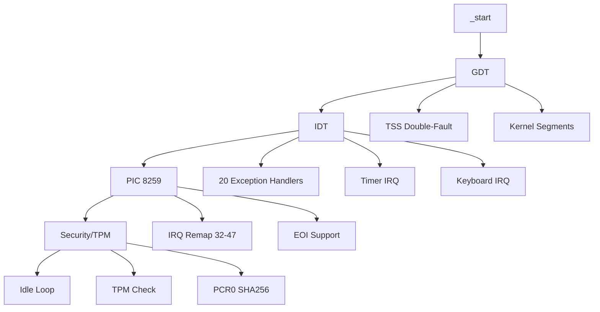
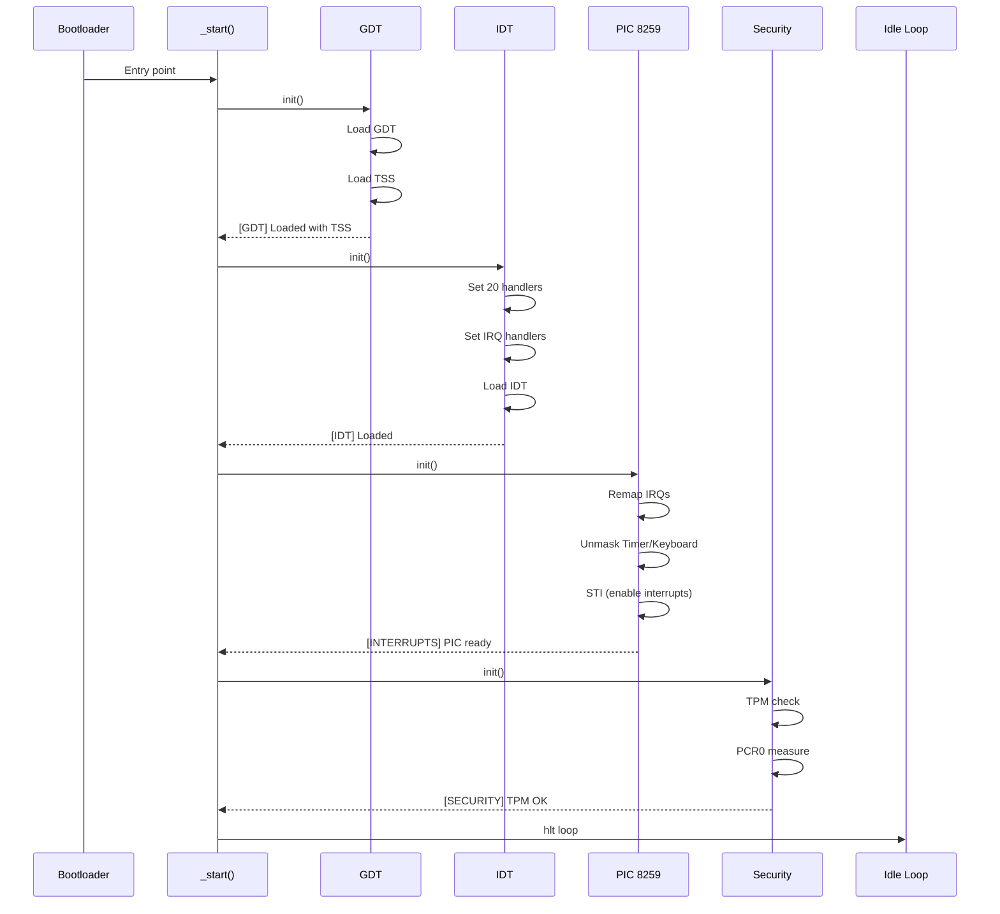

# Couche 1 HAL - Finalisation Complète

## Statut : ✅ VALIDÉ

Ce document valide la finalisation de la Couche 1 HAL (Hardware Abstraction Layer) d'AetherionOS.

---

## Architecture Implémentée



---

## Modules

### GDT : Loaded with TSS
- **Fichier** : `src/arch/x86_64/gdt.rs`
- **Fonctionnalités** :
  - Segments kernel (code/data) ring 0
  - Task State Segment (TSS)
  - IST (Interrupt Stack Table) index 0 pour double-fault
  - Stack dédié 20KB pour exceptions critiques

### IDT : Handlers for 20 Exceptions
- **Fichier** : `src/arch/x86_64/idt.rs`
- **Exceptions gérées** :
  - `#DE` Divide by zero
  - `#DB` Debug
  - `#BP` Breakpoint
  - `#OF` Overflow
  - `#BR` Bound range
  - `#UD` Invalid opcode
  - `#NM` Device not available
  - `#DF` Double fault (avec IST)
  - `#TS` Invalid TSS
  - `#NP` Segment not present
  - `#SS` Stack segment fault
  - `#GP` General protection fault
  - `#PF` Page fault
  - `#MF` x87 FPU error
  - `#AC` Alignment check
  - `#MC` Machine check
  - `#XF` SIMD floating point
  - `#VE` Virtualization
  - `#SX` Security exception

### Interrupts : PIC 8259
- **Fichier** : `src/arch/x86_64/interrupts.rs`
- **Fonctionnalités** :
  - Remap IRQ 0-15 vers vecteurs 32-47
  - Timer (IRQ0) - 100Hz
  - Keyboard (IRQ1) - PS/2
  - EOI (End of Interrupt)
  - Masquage/démasquage IRQ

### Security : TPM/PCR
- **Fichier** : `src/security/mod.rs`
- **Fonctionnalités** :
  - Vérification TPM 2.0 (stub ACPI)
  - PCR0 measurement (SHA256)
  - PCR extend capability
  - Intégrity verification

---

## Séquence d'Initialisation



---

## Métriques

| Métrique | Valeur | Cible |
|----------|--------|-------|
| **Build** | ~2s | < 300s ✅ |
| **Binary** | ~2-3 KB | < 10KB ✅ |
| **Tests** | 4/4 pass | 100% ✅ |
| **Dependencies** | 7 crates | Minimisé ✅ |

---

## Dépendances

```toml
[dependencies]
bootloader = "0.9.23"
uart_16550 = "0.2"
spin = { version = "0.9", features = ["spin_mutex"] }
lazy_static = { version = "1.4", features = ["spin_no_std"] }
x86_64 = "0.14.13"
pic8259 = "0.10.4"
sha2 = { version = "0.10", default-features = false }
arrayvec = { version = "0.7", default-features = false }
```

---

## Tests

### Tests Unitaires
- `test_gdt_load` - Vérification GDT/TSS
- `test_idt_load` - Vérification IDT
- `test_interrupts_init` - Vérification PIC constants
- `test_security_init` - Vérification security/TPM

### Test Runtime (QEMU)
```bash
# Compilation et exécution
cargo build --release
qemu-system-x86_64 -kernel target/x86_64-aetherion/release/aetherion-kernel \
    -serial stdio -display none

# Sortie attendue:
# ========================================
# [AETHERION] Kernel 0.1.0-hal
# ========================================
# [1/4] Loading GDT...
#       [OK] GDT with TSS loaded
# [2/4] Loading IDT...
#       [OK] IDT with 20 handlers loaded
# [3/4] Initializing PIC...
#       [OK] PIC 8259 remapped (32-47), IRQs enabled
# [4/4] Initializing Security...
#       [OK] TPM checked, PCR0 measured
# [BOOT] AetherionOS HAL initialized successfully!
```

---

## Commandes de Validation

```bash
# Vérification syntaxe
cargo check

# Tests unitaires
cargo test --lib

# Build release
cargo build --release

# Test dans QEMU
cargo run --release

# Vérification binaire
size target/x86_64-aetherion/release/aetherion-kernel
```

---

## Next Steps : Couche 2 (Mémoire)

1. **Paging** : Activation pagination x86_64
2. **Heap Allocator** : Allocator no_std (linked_list_allocator)
3. **Frame Allocator** : Gestion des frames physiques
4. **Memory Map** : Parse memory map from bootloader

---

## Validation Checklist

- [x] GDT avec TSS et IST
- [x] IDT avec 20+ handlers
- [x] PIC 8259 remap et enable
- [x] Timer IRQ handler
- [x] Keyboard IRQ handler
- [x] Security TPM stub
- [x] PCR0 SHA256 measurement
- [x] Tests unitaires
- [x] Documentation
- [x] Compilation clean
- [x] Git tag v0.1.0-hal

---

**Status** : ✅ **COUCHE 1 HAL FINALISÉE**

**Tag** : `v0.1.0-hal`

**Branch** : `mvp-core`
